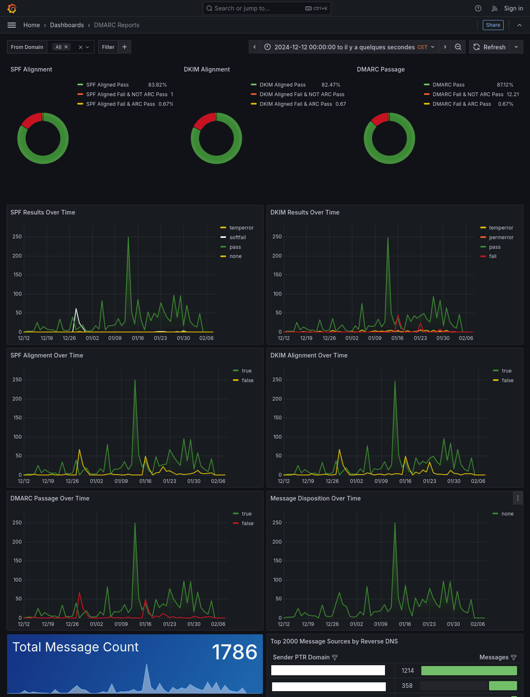

# dmarc-visualizer

Forked version of [dmarc-visualizer by debricked.com](https://github.com/debricked/dmarc-visualizer), thanks to them.

**Changes :**

- Upgrade to a recent version of Grafana
- Pin the `parsedmarc` version
- Replace `Dockerfile`s by original image and `dockerfile_inline`
- Use the GeoIP database installed on the host by [`geoipupdate`](https://maxmind.github.io/geoipupdate/)
- Switch to the [new Grafana dmarc reports dashboard](https://github.com/domainaware/parsedmarc/blob/8.17.0/grafana/Grafana-DMARC_Reports.json-new_panel.json) (a bit personalized for me)
- Add a `run.sh` script to start the necessary services and open the browser (yes, I am really lazy when coming to repetive tasks)

---

Analyse and visualize DMARC results using open-source tools.

* [parsedmarc](https://github.com/domainaware/parsedmarc) for parsing DMARC reports,
* [Elasticsearch](https://www.elastic.co/) to store aggregated data.
* [Grafana](https://grafana.com/) to visualize the aggregated reports.

See the full blog post with instructions at https://debricked.com/blog/2020/05/14/analyse-and-visualize-dmarc-results-using-open-source-tools/.

## Screenshot

